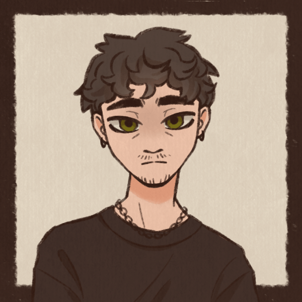
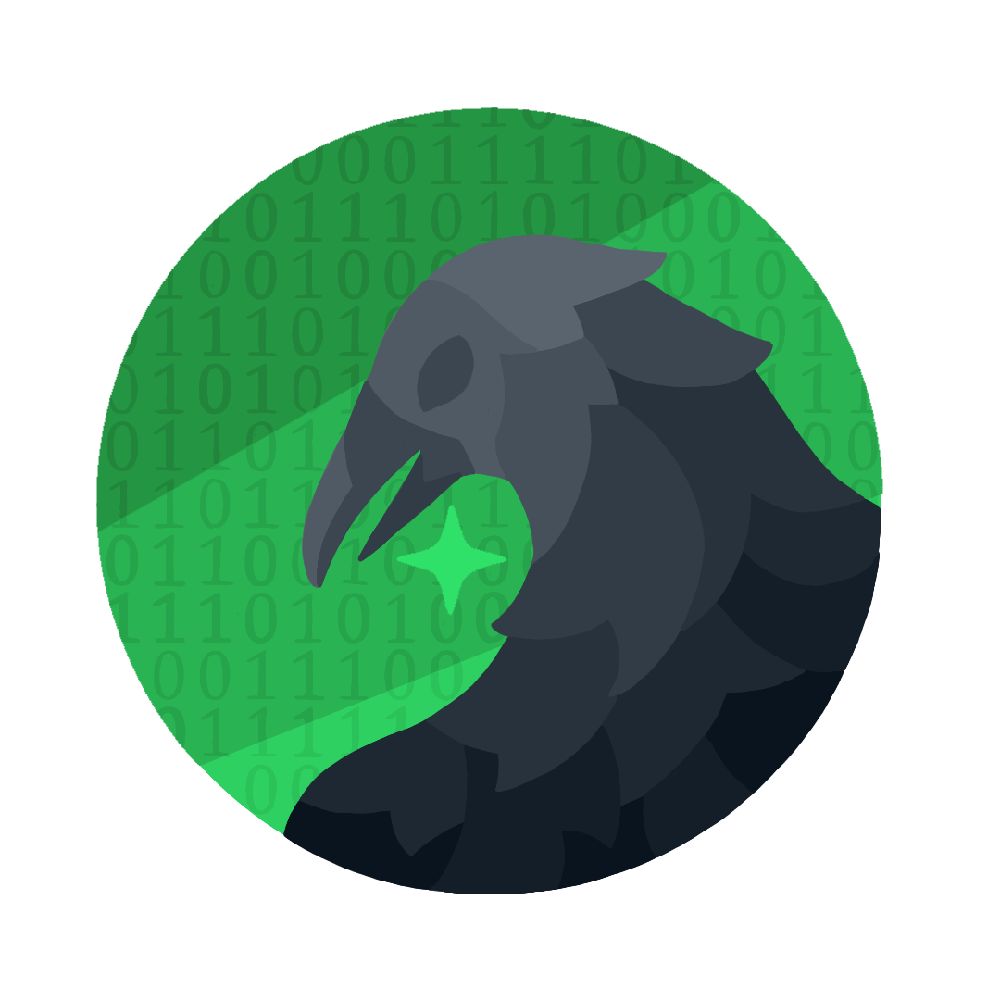

---

# 👨🏻‍💻 Pedro Ross

**`Full-Stack Developer | Founder @ LaborWaze`**

My name is Pedro Henrique Rodrigues Ross, I’m from São Paulo, Brazil, and I work as a Full-Stack Developer building web and mobile applications focused on architecture, scalability, and solving real-world problems.
I am the founder of **LaborWaze**, a technology company where we develop complete systems and document the entire creation process. We share project development, technical decisions, and real challenges through our YouTube channel "[LaborWaze](https://www.youtube.com/@LaborWaze)".
I also share projects and professional updates on my LinkedIn: "[Pedro Ross](https://www.linkedin.com/in/pedro-ross)".

---

  
  
  
  
  
  
  
  
  
  
  

---

## 👤 Personal Links

  

  
  
  

  

## 🚀 LaborWaze

  

  
  
  
  

  

---

<picture align="center">
  <source media="(prefers-color-scheme: dark)" srcset="https://raw.githubusercontent.com/PedroRossZny/PedroRossZny/output/github-contribution-grid-snake-dark.svg">
  <source media="(prefers-color-scheme: light)" srcset="https://raw.githubusercontent.com/PedroRossZny/PedroRossZny/output/github-contribution-grid-snake-dark.svg">
  
</picture>

